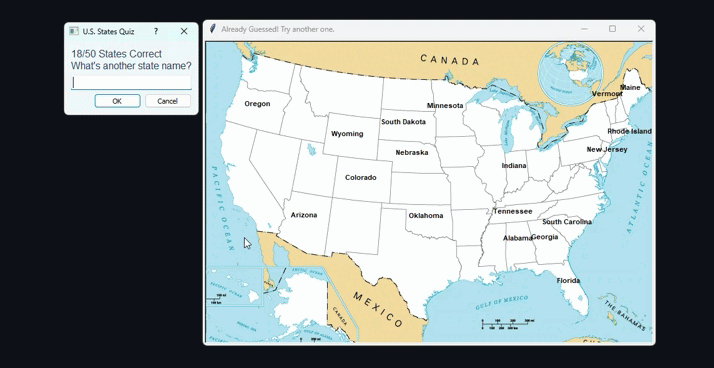

# U.S. States Game

A fun and interactive quiz game built with Python and Turtle graphics, where players try to guess all 50 U.S. states.



## Features
- Interactive map of the U.S. with state names appearing when guessed correctly.
- Hints provided after three consecutive incorrect answers.
- Final results displayed in a table using Tkinter.
- Input dialog styled with PyQt5 for an improved user experience.

## Installation

### Prerequisites
Ensure you have Python installed on your system. You will also need the following libraries:
- `turtle`
- `pandas`
- `PyQt5`
- `tkinter`

You can install the dependencies using:
```sh
pip install pandas PyQt5
```

## How to Run
1. Clone this repository:
   ```sh
   git clone https://github.com/yourusername/us-states-game.git
   ```
2. Navigate to the project directory:
   ```sh
   cd us-states-game
   ```
3. Run the game:
   ```sh
   python main.py
   ```

## How to Play
- A pop-up dialog will prompt you to enter the name of a U.S. state.
- If the answer is correct, the state name will appear on the map.
- If the answer is incorrect, you'll receive a hint after three consecutive wrong attempts.
- The game continues until all 50 states are guessed or the user exits.
- At the end of the game, a results window will display correct and incorrect guesses.

## Files and Directories
- `main.py` - The main script to run the game.
- `write_state.py` - A helper script to write state names on the map.
- `data/50_states.csv` - A dataset containing state names and their coordinates.
- `data/blank_states.png` - The U.S. map used as the game background.


## Contributors
- [MYounesEG](https://github.com/MYounesEG) - Front-end development
- [harrym9](https://github.com/harrym9/us_states_quiz_game/) - Back-end development

